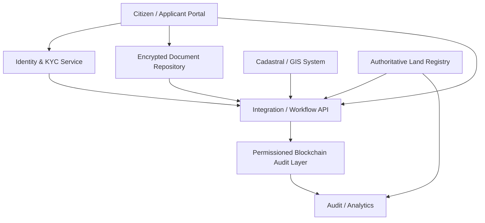

# System Architecture

## 1. Architectural objective

The prototype implements a **hybrid blockchain-assisted land-administration architecture**. The blockchain is not the land registry itself. It is an auditable state-transition and document-integrity layer surrounding an authoritative administrative process.

## 2. Actors

### External / citizen-side actors
- Applicant
- Existing rights holder
- Proposed transferee
- Licensed professional representative

### Institutional actors
- Registry Officer
- Survey/Cadastral Officer
- Authorising Officer
- Dispute/Legal Officer
- System Administrator
- Auditor

The prototype uses blockchain addresses only to authenticate institutional actions. The legal holder is represented by a pseudonymous `holderIdHash`, not by the transaction-signing wallet.

## 3. Layered architecture

## 4. Trust boundaries

The design assumes the authoritative legal decision remains with the competent land administration authority. Blockchain strengthens provenance, role separation, event history and integrity verification but cannot prove that original documents or survey data are substantively correct.

## 5. On-chain data
- application identifiers
- parcel identifiers
- pseudonymous holder identifiers
- source-document manifest hashes
- cadastral/spatial reference hashes
- workflow state
- version numbers
- correction/revocation reason hashes
- dispute case/resolution hashes
- institutional signer addresses
- timestamps and events

## 6. Off-chain data
- Certificates of Occupancy
- deeds
- survey plans
- identity documents
- signatures
- addresses
- valuation documents
- mortgage records
- court orders
- full GIS geometry
- other personal or confidential records

## 7. Core design principle

**Immutable history, mutable authoritative state through controlled and auditable transitions.**

Historical versions are never overwritten. A correction, transfer, revocation or authorised decision produces a new version that supersedes the previous current state.
